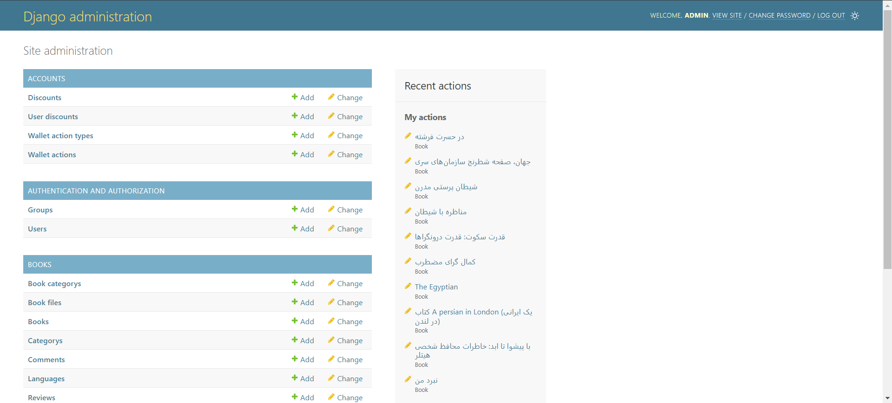
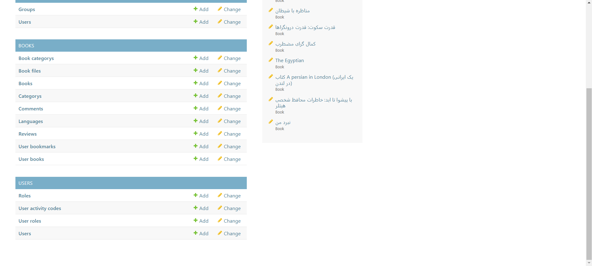
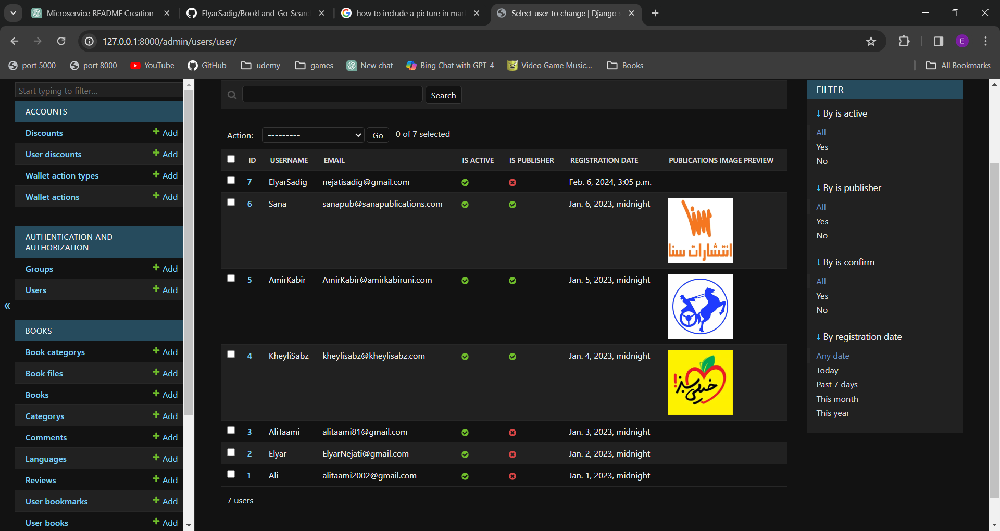
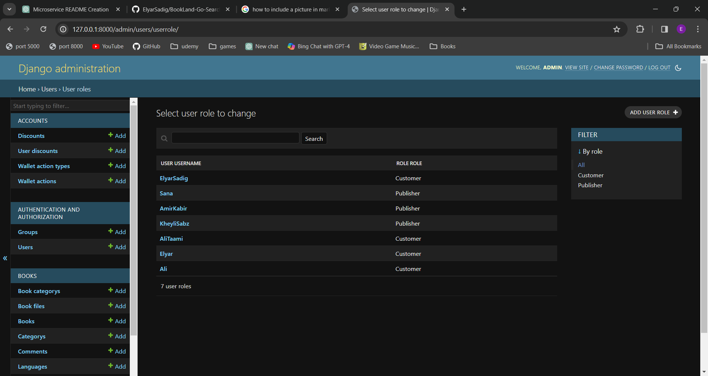
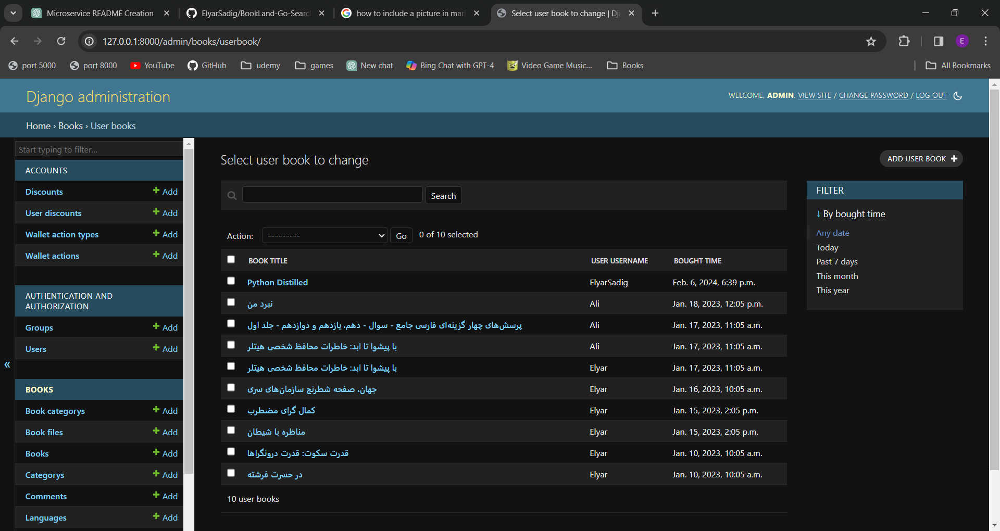
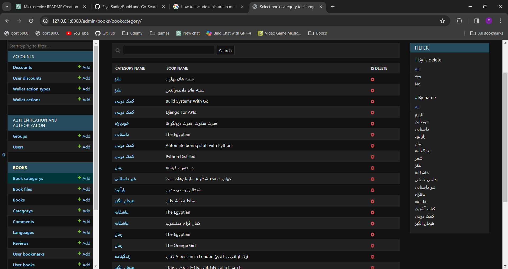
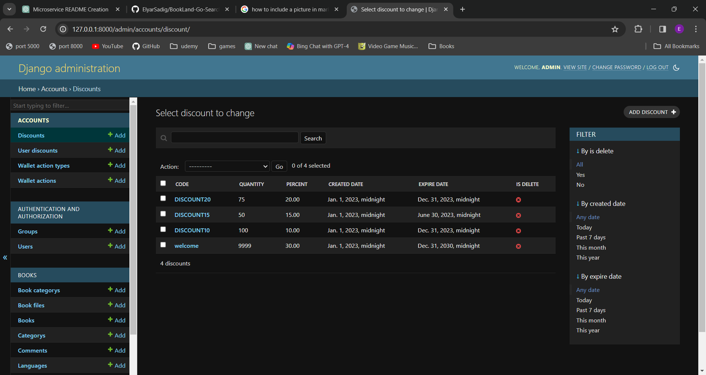
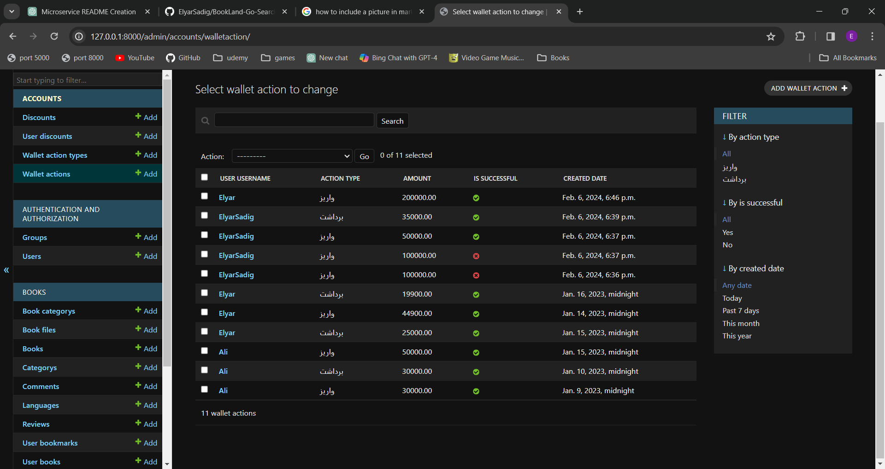

### Admin Panel Overview

Our admin panel offers comprehensive control over the various aspects of our online book reading platform, providing administrators with powerful tools to manage key functionalities efficiently.

#### Accounts Module
- **Wallet Actions:** Monitor and manage user transactions, refunds, and discounts.
- **Discounts:** Oversee available discounts, including codes, quantities, percentages, and expiration dates.
- **User Discounts:** Manage user-specific discount allocations for targeted promotions.

#### Books Module
- **Books:** Add, edit, and delete book entries with detailed metadata and file management.
- **Book Categories:** Organize books into genres for improved discoverability.
- **Reviews & Comments:** Monitor user feedback on books to maintain quality standards.

#### Users Module
- **User Management:** Administer user accounts, roles, and activity codes for efficient user management.

#### Additional Features
- **File Server:** Manage files such as book cover images and identity images.
- **Search Service:** Enhance discoverability within the platform.
- **Order and Payment Management:** Oversee transactions and financial activities.

Our admin panel streamlines administrative tasks, ensuring smooth operation and enhancing user experience on our platform.

