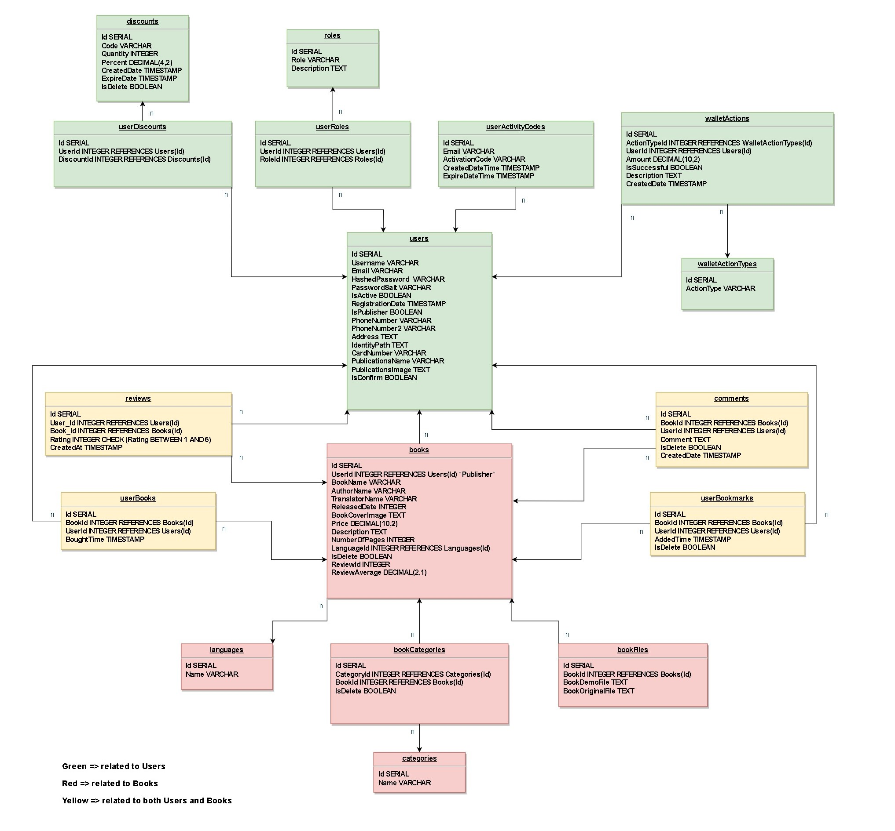
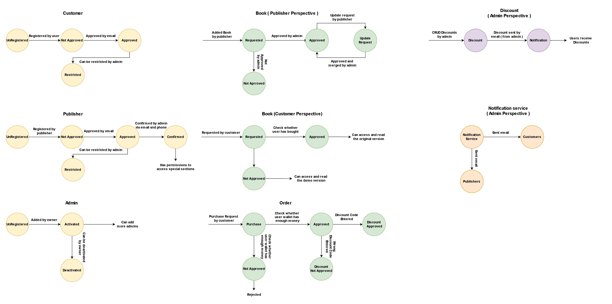

### Introduction to BookLand: Online Book Reading Platform

Welcome to BookLand, your premier destination for accessing a vast library of books and enjoying a seamless reading experience online. Our platform is designed to cater to book enthusiasts, providing a diverse collection of titles across various genres, authors, and languages.

### Screenshots
For a visual overview of our platform's interface and features, please refer to the [Screenshots](./screenshots.md) section. Screenshots showcase different aspects of our online book reading platform, including the user interface, book browsing, and interactive features.

You can view the presentation of BookLand
[View Presentation Videos](https://drive.google.com/drive/folders/1Wje7X72HKo4F0SV681AvAFXqDRcHlkib)

### System Architecture Overview

Our online book reading platform employs a distributed monolithic architecture, leveraging various technologies to deliver a seamless user experience. Here's an overview of the services comprising our system architecture:


- **Django (User & Books Service):** Handles user management, authentication, and book-related functionalities.  
  GitHub Link: [Django Service](https://github.com/ElyarSadig/BookLand_Microservice)
  
- **ASP.NET (Wallet Service):** Manages user wallet functionality, including transactions and balances.  
  GitHub Link: [ASP.NET Wallet Service](https://github.com/alitaami/Bookland)
  
- **Go (File Server):** Responsible for storing and serving book files securely.  
  GitHub Link: [Go File Server](https://github.com/ElyarSadig/BookLand-Go-Fileserver)
  
- **Go (Search Service):** Facilitates book search functionality, enabling users to discover relevant content.  
  GitHub Link: [Go Search Service](https://github.com/ElyarSadig/BookLand-Go-Search-Filter-Service)
  
- **ASP.NET (Order & Discount Service):** Handles order processing and applies discounts for users.  
  GitHub Link: [ASP.NET Order & Discount Service](https://github.com/alitaami/Bookland)
  
- **Node.js (Comment & Review Service):** Manages user comments and reviews for books.  
  GitHub Link: [Node.js Comment & Review Service](https://github.com/sanaishere/comment_review)

- **Front-End Framework:** For the front-end, we've utilized Next.js to build a responsive and interactive user interface.  
GitHub Link: [Next.js Front-End](https://github.com/bookland-project/book-shop)

### Database Schema

BookLand utilizes a PostgreSQL database to store its data. The database schema includes tables for users, books, publishers, authentication, and other related information. Here's a brief overview of the main tables:



### State Diagram

The state diagram illustrates the various states and transitions involved in the authentication process, providing insights into the user flow within the platform.



### API Documentation
For detailed documentation on our API endpoints and how to interact with them, please refer to the [API Documentation](./API-Docs.md) section.

### Admin Panel
For detailed instructions on using the Admin Panel to manage various aspects of the application such as users, books, discounts, and more, please refer to the [Admin Panel Documentation](./Admin-Panel.md) section.

### Usage & Deployment

To deploy our system locally using Docker, follow these steps:

1. **Clone Repositories**: Clone all the service repositories from GitHub to your local machine. Ensure that you have Git installed and configured.
   
2. **Install Docker**: If you haven't already, install Docker on your system. You can download and install Docker Desktop from the official [Docker website](https://www.docker.com/products/docker-desktop).

3. **Create Docker Network**: Create a Docker network to enable communication between the services. Run the following command in your terminal:

    ```bash
    docker network create my_network
    ```

    This command will create a Docker network named `my_network`.

4. **Compose Services**: Navigate to each service directory and use Docker Compose to bring up the services. Run the following command in each service directory:

    ```bash
    docker-compose up -d
    ```

    This command will start the service containers in detached mode, allowing them to run in the background.

5. **Verify Deployment**: Once all services are up and running, you can verify the deployment by accessing the respective endpoints or by interacting with the system through the provided interfaces.


